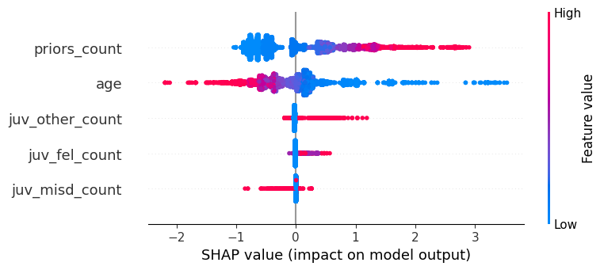
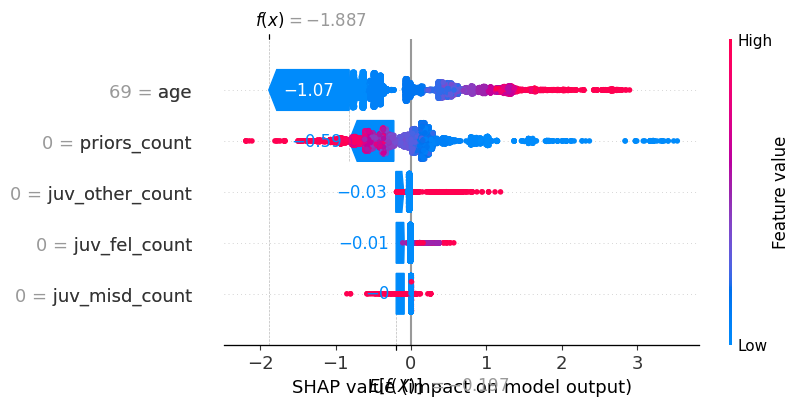

# Legal-XAI-Framework

Translating SHAP explanations into Daubert-aligned narrative justifications for judicial AI.

---

## Overview
This project investigates how Explainable Artificial Intelligence (XAI) can be adapted to meet legal requirements for transparency and evidentiary reliability in judicial decision-making. Specifically, it evaluates whether SHAP (Shapley Additive Explanations) values can be translated into narrative justifications that are intelligible to legal decision-makers and aligned with the **Daubert** standard for admissibility of scientific evidence.

Rather than treating explanations as purely mathematical outputs, this framework focuses on **legal comprehensibility**: whether an explanation can be understood, challenged, and evaluated by judges, attorneys, and defendants in a courtroom context.

---

## Research Question
**Can SHAP-based feature attributions be systematically translated into legally intelligible narratives that support due process and satisfy Daubert-style reliability expectations?**

---

## Methodology (Pipeline)
The project follows a three-stage pipeline:

1. **Model Training:** Train a baseline risk prediction model (e.g., XGBoost) on a recidivism risk dataset (e.g., COMPAS).
2. **Post-hoc Explanation:** Apply SHAP to compute feature-level contributions for both global and local explanations.
3. **Narrative Translation Layer:** Convert SHAP values into structured narrative explanations that resemble judicial reasoning rather than raw statistical weights.

This approach operationalizes the **“narrative gap”** between statistical explanation (feature importance values) and legal justification (court-usable reasons).

---

## Demo Output

The interactive demo produces three distinct layers of output for a single case:

1. **Prediction Output**  
   A probabilistic estimate of two-year recidivism with a binary decision threshold.

2. **Narrative Justification (Prototype)**  
   A court-facing explanation derived from SHAP attributions, translated into
   legally intelligible language without exposing raw model weights.

3. **Raw SHAP Output (Audit View)**  
   A transparent, tabular representation of feature attributions intended for
   expert review, auditing, and adversarial testing.

These outputs illustrate the separation between decision-facing explanations
and audit-facing transparency that motivates the framework’s core contribution.

### Prediction and Narrative View


### Raw SHAP Audit View


## Key Contribution: The “Narrative Gap”
Most XAI systems output feature weights (e.g., `Prior convictions: +0.42`). Courts, however, require **reasons** that are intelligible, contestable, and aligned with legal norms.

This project introduces a rule-based framework that translates SHAP attributions into courtroom-oriented narrative statements, for example:

- **Raw SHAP:** `Prior convictions: +0.42`
- **Narrative:** “The risk score increased primarily due to a documented pattern of prior convictions, which the model weights strongly based on historical sentencing outcomes.”

---

## Legal Alignment: Daubert-Informed Framing
The Daubert standard generally emphasizes reliability and scientific validity (e.g., testability, known error rates, standards/controls, and general acceptance). This project frames narrative explanations as a form of **legal auditability**, supporting:

- **Transparency:** explanations must account for the decision outcome
- **Contestability:** reasons can be examined and challenged
- **Reliability:** outputs can be validated and compared across cases
- **Due Process:** defendants and counsel can meaningfully understand and respond

> Note: This repository is a research and educational project and does not constitute legal advice.

---

## Repository Structure
```text
legal-xai-framework/
├── data/                 # Dataset (or download instructions)
├── src/                  # Core code (training, SHAP, narrative logic)
│   ├── train_model.py    # Train baseline model
│   ├── explain.py        # Generate SHAP explanations
│   └── narrative.py      # SHAP-to-narrative translation rules
├── docs/                 # Legal framework + writeups (Daubert checklist, paper draft)
├── requirements.txt      # Python dependencies
└── README.md             # Project overview

## How to Run

### 1. Install dependencies
```bash
pip install -r requirements.txt

## Demo (Streamlit)

Run locally:

```bash
pip install -r requirements.txt
streamlit run app.py
---

## 🔍 Model Explainability (SHAP)

### Global Feature Importance
This plot shows which features most influence recidivism predictions.



---

### Local Explanation (Individual Prediction)
This plot explains why a specific individual was predicted high or low risk.



---

## 📊 Model Performance
- AUC: ~0.74  
- Accuracy: ~0.69  
- Dataset: COMPAS (ProPublica)

This system demonstrates how explainable AI can be applied to legal risk assessment models under Daubert-style standards.
